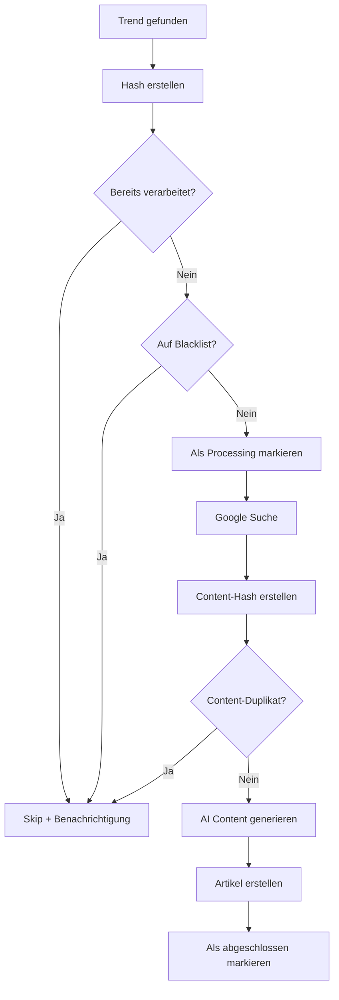

# 🔄 Duplikatssystem - GreenMindShift Blog

## Übersicht

Das Duplikatssystem verhindert, dass bereits verarbeitete Google Trends erneut zu Blog-Artikeln umgewandelt werden. Es verwendet mehrere Ebenen der Duplikatserkennung für maximale Effizienz.

## 🏗️ Architektur

### Datenbank-Tabellen

#### ProcessedTrend
Speichert alle verarbeiteten Google Trends mit eindeutigen Hashes.

```sql
CREATE TABLE processed_trends (
  id TEXT PRIMARY KEY,
  trend_hash TEXT UNIQUE,     -- SHA256 Hash des Trend-Inhalts
  query TEXT,                 -- Ursprünglicher Suchbegriff
  traffic TEXT,               -- Traffic-Information
  date TEXT,                  -- Trend-Datum
  processed BOOLEAN,          -- Wurde verarbeitet?
  article_created BOOLEAN,    -- Wurde Artikel erstellt?
  article_id TEXT,            -- Referenz zum Artikel
  source_data JSON,           -- Komplette Trend-Daten
  reason TEXT,                -- Grund für Nicht-Verarbeitung
  created_at TIMESTAMP,
  updated_at TIMESTAMP
);
```

#### ContentHash
Speichert Hashes von generiertem Content zur erweiterten Duplikatserkennung.

```sql
CREATE TABLE content_hashes (
  id TEXT PRIMARY KEY,
  content_hash TEXT UNIQUE,   -- SHA256 Hash des Contents
  title TEXT,                 -- Titel zur Identifikation
  source TEXT,                -- Quelle (google_trends, manual, etc.)
  created_at TIMESTAMP
);
```

#### TrendBlacklist
Blacklist für unerwünschte Keywords.

```sql
CREATE TABLE trend_blacklist (
  id TEXT PRIMARY KEY,
  keyword TEXT UNIQUE,        -- Blacklisted Keyword
  reason TEXT,                -- Grund für Blacklisting
  active BOOLEAN,             -- Ist aktiv?
  created_at TIMESTAMP,
  updated_at TIMESTAMP
);
```

## 🔍 Duplikatserkennung - Ebenen

### 1. Trend-Hash Prüfung
**Zweck**: Verhindert Verarbeitung identischer Trends  
**Methode**: SHA256 Hash aus Query + Datum + Traffic  
**API**: `POST /api/trends/check-processed`

```javascript
const trendContent = JSON.stringify({
  query: "nachhaltigkeit",
  date: "2024-01-15",
  traffic: "50K+"
});
const trendHash = crypto.createHash('sha256')
  .update(trendContent).digest('hex');
```

### 2. Blacklist-Prüfung
**Zweck**: Filtert unerwünschte Keywords  
**Methode**: Keyword-Matching (exakt und Teilstring)  
**API**: Integriert in `check-processed`

```javascript
// Beispiel Blacklist Einträge
const blacklist = [
  "cryptocurrency", // Nicht nachhaltigkeitsrelevant
  "bitcoin",        // Nicht nachhaltigkeitsrelevant
  "gewinnspiel"     // Spam-verdächtig
];
```

### 3. Content-Hash Prüfung
**Zweck**: Verhindert ähnlichen generierten Content  
**Methode**: SHA256 Hash aus normalisiertem Content  
**API**: `POST /api/content/check-hash`

```javascript
const normalizedContent = content
  .toLowerCase()
  .replace(/\s+/g, ' ')
  .replace(/[^\w\s]/g, '')
  .trim();
const contentHash = crypto.createHash('sha256')
  .update(`${title}_${normalizedContent}`).digest('hex');
```

### 4. Ähnlichkeits-Analyse
**Zweck**: Erkennt semantisch ähnliche Inhalte  
**Methode**: Jaccard-Ähnlichkeit zwischen Wortmengen  
**Schwellenwert**: 70% Ähnlichkeit

```javascript
function calculateSimilarity(text1, text2) {
  const words1 = new Set(text1.toLowerCase().split(/\s+/));
  const words2 = new Set(text2.toLowerCase().split(/\s+/));
  
  const intersection = new Set([...words1].filter(x => words2.has(x)));
  const union = new Set([...words1, ...words2]);
  
  return intersection.size / union.size;
}
```

## 🔄 N8N Workflow Integration

### Workflow-Schritte mit Duplikatserkennung

1. **Google Trends abrufen**
2. **Trends filtern + Hash erstellen**
3. **Duplikat prüfen** (`/api/trends/check-processed`)
4. **Blacklist prüfen** (integriert)
5. **Als 'in Bearbeitung' markieren** (`/api/trends/mark-processing`)
6. **Google Suche durchführen**
7. **Content-Hash erstellen**
8. **Content-Duplikat prüfen** (`/api/content/check-hash`)
9. **AI Content generieren** (nur wenn einzigartig)
10. **Artikel erstellen**
11. **Als abgeschlossen markieren**
12. **Content-Hash speichern**

### Entscheidungslogik



## 📊 API Endpoints

### `/api/trends/check-processed`
**Methode**: POST  
**Zweck**: Prüft ob Trend bereits verarbeitet wurde

```json
// Request
{
  "trendHash": "abc123...",
  "query": "nachhaltigkeit",
  "date": "2024-01-15"
}

// Response
{
  "isProcessed": false,
  "isBlacklisted": false,
  "existingTrend": null,
  "blacklistReason": null
}
```

### `/api/trends/mark-processing`
**Methode**: POST  
**Zweck**: Markiert Trend als in Bearbeitung

```json
// Request
{
  "trendHash": "abc123...",
  "query": "nachhaltigkeit",
  "traffic": "50K+",
  "date": "2024-01-15",
  "sourceData": { ... }
}

// Response
{
  "success": true,
  "processedTrend": {
    "id": "clr123...",
    "trendHash": "abc123...",
    "processed": true
  }
}
```

### `/api/content/check-hash`
**Methode**: POST  
**Zweck**: Prüft Content-Duplikate

```json
// Request
{
  "contentHash": "def456..."
}

// Response
{
  "exists": false,
  "existingContent": null,
  "similarArticles": [],
  "recommendation": "PROCEED"
}
```

## 🛠️ Wartung & Monitoring

### Automatische Bereinigung
```sql
-- Lösche alte, nicht-verarbeitete Trends (älter als 30 Tage)
DELETE FROM processed_trends 
WHERE created_at < NOW() - INTERVAL '30 days' 
AND article_created = false;
```

### Statistiken abrufen
```javascript
import { getTrendStatistics } from '@/utils/deduplication';

const stats = await getTrendStatistics();
// {
//   totalProcessed: 150,
//   articlesCreated: 45,
//   blacklisted: 12,
//   duplicatesSkipped: 93
// }
```

### Monitoring Queries
```sql
-- Trends der letzten 7 Tage
SELECT 
  DATE(created_at) as date,
  COUNT(*) as total_trends,
  SUM(CASE WHEN article_created THEN 1 ELSE 0 END) as articles_created,
  SUM(CASE WHEN processed AND NOT article_created THEN 1 ELSE 0 END) as duplicates_skipped
FROM processed_trends 
WHERE created_at >= NOW() - INTERVAL '7 days'
GROUP BY DATE(created_at)
ORDER BY date DESC;

-- Top Blacklist Keywords
SELECT keyword, reason, COUNT(*) as hit_count
FROM trend_blacklist 
WHERE active = true
ORDER BY hit_count DESC;

-- Ähnlichkeits-Analyse Performance
SELECT 
  AVG(similarity_score) as avg_similarity,
  COUNT(*) as total_checks,
  SUM(CASE WHEN similarity_score > 0.7 THEN 1 ELSE 0 END) as high_similarity
FROM content_similarity_logs
WHERE created_at >= NOW() - INTERVAL '24 hours';
```

## ⚙️ Konfiguration

### Environment Variables
```env
# Duplikatserkennung
SIMILARITY_THRESHOLD=0.7          # Ähnlichkeits-Schwellenwert
CLEANUP_DAYS=30                   # Bereinigung nach X Tagen
MAX_SIMILARITY_CHECKS=50          # Max. Artikel für Ähnlichkeitsprüfung

# API Authentication
BLOG_API_TOKEN=your-secure-token  # Token für N8N API Calls
```

### Anpassbare Parameter
```javascript
// In deduplication.ts
const CONFIG = {
  SIMILARITY_THRESHOLD: 0.7,        // 70% Ähnlichkeit
  TITLE_WEIGHT: 0.4,               // Titel-Gewichtung
  CONTENT_WEIGHT: 0.6,             // Content-Gewichtung
  CONTENT_SAMPLE_LENGTH: 500,      // Zeichen für Ähnlichkeitsprüfung
  MAX_ARTICLES_TO_CHECK: 50,       // Performance-Limit
  CLEANUP_INTERVAL_DAYS: 30,       // Bereinigung
};
```

## 🚨 Troubleshooting

### Häufige Probleme

#### 1. Zu viele Duplikate erkannt
**Symptom**: Kaum neue Artikel werden erstellt  
**Lösung**: Similarity Threshold erhöhen (0.8+)

#### 2. Duplikate werden nicht erkannt
**Symptom**: Ähnliche Artikel werden erstellt  
**Lösung**: Threshold senken (0.6-), mehr Keywords für Blacklist

#### 3. Performance-Probleme
**Symptom**: Lange API Response Zeiten  
**Lösung**: `MAX_ARTICLES_TO_CHECK` reduzieren, Content Sample kürzen

#### 4. Hash-Kollisionen
**Symptom**: Verschiedene Trends haben gleichen Hash  
**Lösung**: Hash-Algorithmus erweitern um zusätzliche Felder

### Debug Commands
```bash
# Prüfe ProcessedTrend Tabelle
npx prisma studio

# API Endpoint testen
curl -X POST https://greenmindshift.com/api/trends/check-processed \
  -H "Authorization: Bearer $BLOG_API_TOKEN" \
  -H "Content-Type: application/json" \
  -d '{"trendHash":"test123","query":"test"}'

# Logs überprüfen
kubectl logs -f deployment/greenmindshift-blog -n greenmindshift | grep "duplicate"
```

## 📈 Performance Optimierung

### Datenbank Indizes
```sql
-- Optimiere Abfragen
CREATE INDEX idx_processed_trends_hash ON processed_trends(trend_hash);
CREATE INDEX idx_processed_trends_query ON processed_trends(query);
CREATE INDEX idx_processed_trends_date ON processed_trends(date);
CREATE INDEX idx_content_hashes_hash ON content_hashes(content_hash);
CREATE INDEX idx_blacklist_keyword ON trend_blacklist(keyword);
```

### Caching-Strategien
```javascript
// Redis Cache für häufige Blacklist-Abfragen
const CACHE_TTL = 3600; // 1 Stunde

async function isBlacklistedCached(query) {
  const cacheKey = `blacklist:${query.toLowerCase()}`;
  const cached = await redis.get(cacheKey);
  
  if (cached !== null) {
    return JSON.parse(cached);
  }
  
  const result = await isKeywordBlacklisted(query);
  await redis.setex(cacheKey, CACHE_TTL, JSON.stringify(result));
  
  return result;
}
```

## 🔮 Erweiterte Features

### Machine Learning Integration
```javascript
// Zukünftige Erweiterung: ML-basierte Ähnlichkeitserkennung
import { SentenceTransformer } from '@tensorflow/tfjs';

async function calculateSemanticSimilarity(text1, text2) {
  const model = await SentenceTransformer.load('universal-sentence-encoder');
  const embeddings = await model.embed([text1, text2]);
  return cosineSimilarity(embeddings[0], embeddings[1]);
}
```

### Dynamische Blacklist
```javascript
// Automatische Blacklist-Erweiterung basierend auf User-Feedback
async function autoUpdateBlacklist() {
  const lowQualityArticles = await prisma.article.findMany({
    where: {
      aiGenerated: true,
      // Artikel mit niedrigen Engagement-Metriken
      views: { lt: 10 },
      createdAt: { gte: new Date(Date.now() - 7 * 24 * 60 * 60 * 1000) }
    }
  });
  
  // Extrahiere häufige Keywords aus low-quality Artikeln
  // und füge zur Blacklist hinzu
}
``` 